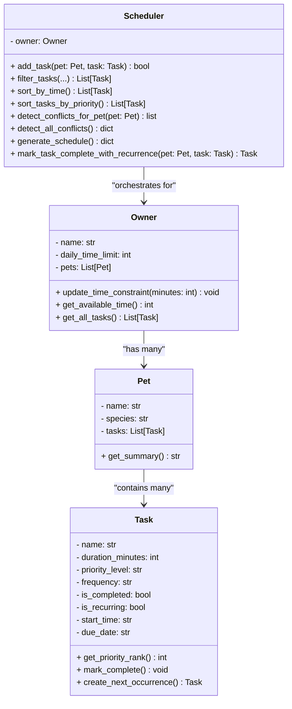

# PawPal+ System Design

## Updated Class Diagram (Final Implementation)



## Key Changes from Phase 1 to Final Implementation

### ✅ **What Was Added:**

#### **Task Class Enhancements:**
- ➕ `frequency` attribute (daily, weekly, once)
- ➕ `is_recurring` flag for repeating tasks
- ➕ `start_time` for scheduling conflicts (HH:MM format)
- ➕ `due_date` for deadline tracking (YYYY-MM-DD format)
- ➕ `is_completed` status tracking
- ➕ `create_next_occurrence()` method with timedelta-based date arithmetic
- ➕ `mark_complete()` method

#### **Owner Class Enhancements:**
- ➕ `pets` list (manages multiple pets, not just one)
- ➕ `get_all_tasks()` method to aggregate tasks across all pets

#### **Pet Class Enhancements:**
- ➕ `tasks` list (directly stores tasks instead of Scheduler managing them)

#### **Scheduler Class - Major Expansion:**

**Filtering Methods (NEW):**
- `filter_tasks()` - Multi-criteria filtering (pet name, completion, priority)
- `get_tasks_by_pet_name()`, `get_tasks_by_completion_status()`, `get_recurring_tasks()`
- `get_incomplete_tasks()`, `get_completed_tasks()`

**Sorting Methods (EXPANDED):**
- `sort_by_time()` - Chronological sorting by start_time
- `sort_tasks_by_priority()` - Weighted Greedy (priority + duration)
- `sort_tasks_by_start_time_then_priority()` - Multi-level sorting

**Conflict Detection Methods (NEW):**
- `detect_conflicts_for_pet()` - O(k²) same-pet detection
- `detect_all_conflicts()` - O(p × k² + n²) comprehensive detection
- `check_task_conflict_on_add()` - Lightweight conflict checking
- `get_conflicts_as_string()` - Human-readable reports
- `_check_time_overlap()` - O(1) interval overlap formula

**Advanced Methods (NEW):**
- `mark_task_complete_with_recurrence()` - Auto-generates next occurrences
- `get_schedule_with_conflict_warnings()` - Schedule + warnings
- `get_time_conflicts_for_pet_soft()` - Soft warnings
- `_time_to_minutes()` - Time parsing helper

### ❌ **What Was Removed/Changed:**

1. **Scheduler.tasks** ❌ → Removed (tasks now owned by Pets, accessed via Owner)
2. **Scheduler.pet** ❌ → Removed (now handles multiple pets via Owner)
3. **Task.is_high_priority()** ❌ → Removed (use `get_priority_rank() == 3` instead)
4. **Scheduler.check_time_fit()** → Simplified (integrated into generate_schedule)

## Relationship Diagram

```
Owner (manages constraints)
  ├─→ Pet 1
  │    ├─→ Task 1 (HIGH, 09:00, "Morning walk")
  │    ├─→ Task 2 (MEDIUM, 14:00, "Playtime")
  │    └─→ Task 3 (LOW, 18:00, "Grooming")
  │
  ├─→ Pet 2
  │    ├─→ Task 4 (HIGH, 08:00, "Feeding")
  │    └─→ Task 5 (MEDIUM, 12:00, "Training")
  │
  └─→ Scheduler (orchestrates)
       ├─ Filters (by pet, priority, status)
       ├─ Sorts (by priority, time)
       ├─ Detects conflicts
       └─ Generates optimal daily schedule
```

## Algorithm Summary

| Algorithm | Type | Time | Purpose |
|-----------|------|------|---------|
| **Weighted Greedy Sort** | Sorting | O(n log n) | Maximize task completion |
| **Interval Overlap Detection** | Detection | O(1) | Check time conflicts |
| **Conflict Detection (same-pet)** | Graph | O(k²) | Find task overlaps per pet |
| **Conflict Detection (all)** | Graph | O(p × k² + n²) | Find all conflicts |
| **Recurring Task Generator** | Arithmetic | O(1) | Calculate next due date |
| **Multi-Criteria Filter** | Search | O(n) | Find tasks by criteria |
| **Schedule Generation** | Greedy | O(n log n) | Create optimal daily plan |

## Design Principles

✅ **Separation of Concerns**: Pet owns tasks, Owner owns pets, Scheduler orchestrates  
✅ **Rich Domain Model**: Task has all scheduling attributes (time, date, priority, recurrence)  
✅ **Multi-Pet Support**: Handles multiple pets and conflict detection across them  
✅ **Algorithmic Depth**: O(1) overlap checks power O(n) scheduling decisions  
✅ **Extensible Filtering**: Universal filter for any combination of criteria  
✅ **Recurring Task Automation**: Auto-generates next occurrences with timedelta arithmetic
