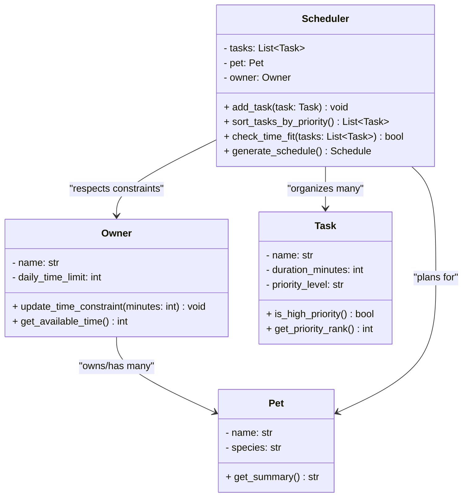

# PawPal+ System Design

## Class Diagram

## Class Descriptions

### 1. **Pet Class**
- **Purpose**: Represents the pet being cared for
- **Data**: Stores the pet's name and species
- **Behavior**: Provides a summary of the pet's identity for use in the schedule

### 2. **Owner Class**
- **Purpose**: Represents the pet owner and their constraints
- **Data**: Stores owner's name and daily time available for pet care
- **Behavior**: Manages and updates the time constraints that limit what can be scheduled

### 3. **Task Class**
- **Purpose**: Represents individual pet care activities
- **Data**: Stores task name, duration (in minutes), and priority level
- **Behavior**: Identifies high-priority "must-do" tasks to help the scheduler prioritize

### 4. **Scheduler Class** ⭐ (The Brain)
- **Purpose**: Orchestrates the scheduling logic
- **Data**: Maintains a list of tasks and references to the pet and owner
- **Behavior**:
  - Sorts tasks by priority
  - Validates that selected tasks fit within the owner's time limit
  - Generates the final ordered daily plan

## Relationships

- **Scheduler → Pet**: Uses pet information in the output schedule
- **Scheduler → Owner**: Respects owner's time constraints when planning
- **Scheduler → Task**: Organizes and prioritizes multiple tasks

## Key Design Principles

✅ **Separation of Concerns**: Each class has one job  
✅ **Single Responsibility**: Pet stores pet info, Task stores task info, Scheduler coordinates  
✅ **Constraint Validation**: Scheduler ensures tasks fit within owner's time limit  
✅ **Priority-Based Planning**: High-priority tasks take precedence in scheduling
